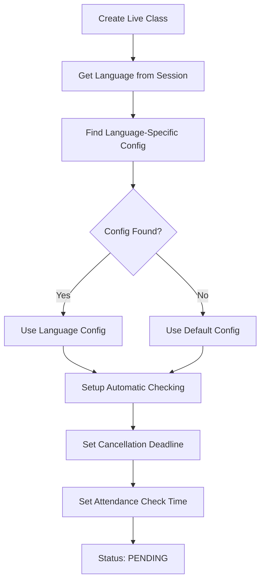
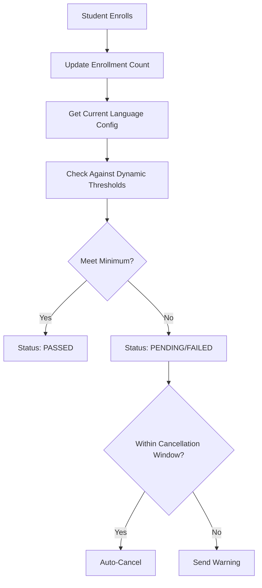
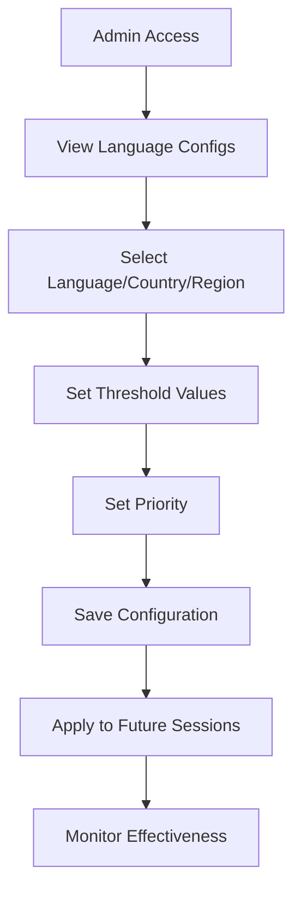

# Live Class Attendance Threshold System

## **🎯 Overview**

This system ensures that live classes only run when they meet minimum attendance thresholds for profitability. Based on the business model where one premium subscription ($24.99/month) pays for 1 hour of instructor time ($25/hour), the system enforces:

- **Minimum Threshold**: 4 students required for class to run (break-even)
- **Profit Threshold**: 8 students required for platform to earn profit
- **Automatic Cancellation**: Classes below minimum are automatically cancelled 24 hours before start time
- **Language-Specific Thresholds**: Admins can configure different thresholds per language/country/region

---

## **💰 Business Logic**

### **Cost Structure**
- **Instructor Cost**: $25/hour (configurable per language/region)
- **Platform Revenue**: $24.99 per premium subscriber (configurable per language/region)
- **Break-even Point**: 4 students (4 × $24.99 = $99.96 ≈ $100 for 1 hour)
- **Profit Point**: 8 students (8 × $24.99 = $199.92 for 1 hour = $99.92 profit)

### **Language-Specific Thresholds**
Admins can configure different thresholds based on:
- **Language**: Different thresholds for English, Spanish, French, etc.
- **Country**: Regional variations (US vs UK English, Spain vs Mexico Spanish)
- **Region**: Broad regional settings (North America, Europe, Asia-Pacific)

### **Threshold Calculations**
```
Instructor Cost = $25/hour × duration_hours (configurable per language)
Platform Revenue = enrolled_students × $24.99 (configurable per language)
Net Profit = Platform Revenue - Instructor Cost
Margin = (Net Profit / Platform Revenue) × 100

Minimum Students = ceil(Instructor Cost / Platform Revenue per Student)
Profit Students = ceil(Instructor Cost / Platform Revenue per Student) × 2
```

---

## **🏗️ System Architecture**

### **Database Schema Extensions**

#### **VideoSession Model**
```prisma
model VideoSession {
  // ... existing fields ...
  
  // Minimum attendance threshold fields for profitability
  minAttendanceThreshold Int      @default(4) // Minimum students required for class to run
  profitMarginThreshold  Int      @default(8) // Minimum students for platform to earn profit
  instructorHourlyRate   Float    @default(25.0) // Instructor cost per hour
  platformRevenuePerStudent Float @default(24.99) // Revenue per premium subscriber
  autoCancelIfBelowThreshold Boolean @default(true) // Auto-cancel if below minimum
  cancellationDeadline   DateTime? // Deadline for cancellation (e.g., 24h before class)
  attendanceCheckTime    DateTime? // When to check attendance threshold
  thresholdCheckStatus   String    @default("PENDING") @db.VarChar(20) // PENDING, PASSED, FAILED, CANCELLED
}
```

#### **LanguageAttendanceThreshold Model**
```prisma
model LanguageAttendanceThreshold {
  id                        String   @id @default(uuid()) @db.VarChar(36)
  language                  String   @db.VarChar(10) // Language code (e.g., "en", "es", "fr")
  country                   String?  @db.VarChar(50) // Optional country code (e.g., "US", "UK", "CA")
  region                    String?  @db.VarChar(50) // Optional region (e.g., "North America", "Europe")
  minAttendanceThreshold    Int      @default(4) // Minimum students required for class to run
  profitMarginThreshold     Int      @default(8) // Minimum students for platform to earn profit
  instructorHourlyRate      Float    @default(25.0) // Instructor cost per hour for this language/region
  platformRevenuePerStudent Float    @default(24.99) // Revenue per student for this language/region
  autoCancelIfBelowThreshold Boolean @default(true) // Auto-cancel if below minimum
  cancellationDeadlineHours Int      @default(24) // Hours before class to check
  isActive                  Boolean  @default(true) // Whether this threshold configuration is active
  priority                  Int      @default(0) // Priority for matching (higher = more specific)
  notes                     String?  @db.Text // Admin notes about this configuration
  createdBy                 String   @db.VarChar(36) // Admin who created this configuration
  updatedBy                 String   @db.VarChar(36) // Admin who last updated this configuration
  createdAt                 DateTime @default(now())
  updatedAt                 DateTime @updatedAt

  // Relations
  createdByUser             User     @relation("LanguageThresholdCreatedBy", fields: [createdBy], references: [id])
  updatedByUser             User     @relation("LanguageThresholdUpdatedBy", fields: [updatedBy], references: [id])

  @@unique([language, country, region])
  @@index([language, country, region, isActive])
  @@index([priority])
}
```

### **Core Services**

#### **LiveClassAttendanceService**
The service provides comprehensive attendance threshold management:

**Key Methods:**
- `analyzeAttendanceThreshold()` - Calculate profitability analysis
- `checkAttendanceThreshold()` - Determine if class should run
- `autoCancelBelowThresholdSessions()` - Batch process cancellations
- `setupThresholdChecking()` - Initialize automatic checking
- `getProfitabilityReport()` - Generate detailed financial report

#### **LanguageAttendanceThresholdService**
The service manages language-specific threshold configurations:

**Key Methods:**
- `getThresholdConfig()` - Get best matching configuration for language/country/region
- `createThresholdConfig()` - Create new language-specific configuration
- `updateThresholdConfig()` - Update existing configuration
- `deleteThresholdConfig()` - Delete configuration
- `getAllThresholdConfigs()` - Get all configurations
- `getAvailableLanguages()` - Get available languages
- `getAvailableCountries()` - Get available countries for a language
- `getAvailableRegions()` - Get available regions for a language
- `bulkUpdateThresholdConfigs()` - Bulk update configurations
- `importThresholdConfigs()` - Import configurations from CSV/JSON

---

## **⚙️ Configuration**

### **Default Settings**
```typescript
const DEFAULT_CONFIG = {
  minAttendanceThreshold: 4,        // Minimum students required
  profitMarginThreshold: 8,         // Students needed for profit
  instructorHourlyRate: 25.0,       // Cost per hour
  platformRevenuePerStudent: 24.99, // Revenue per student
  autoCancelIfBelowThreshold: true, // Auto-cancel if below minimum
  cancellationDeadlineHours: 24     // Hours before class to check
};
```

### **Language-Specific Configuration Examples**

#### **English (Global)**
```typescript
{
  language: "en",
  country: null,
  region: null,
  minAttendanceThreshold: 4,
  profitMarginThreshold: 8,
  instructorHourlyRate: 25.0,
  platformRevenuePerStudent: 24.99,
  priority: 0
}
```

#### **English (US)**
```typescript
{
  language: "en",
  country: "US",
  region: null,
  minAttendanceThreshold: 5,
  profitMarginThreshold: 10,
  instructorHourlyRate: 30.0,
  platformRevenuePerStudent: 29.99,
  priority: 10
}
```

#### **Spanish (Spain)**
```typescript
{
  language: "es",
  country: "ES",
  region: null,
  minAttendanceThreshold: 3,
  profitMarginThreshold: 6,
  instructorHourlyRate: 20.0,
  platformRevenuePerStudent: 19.99,
  priority: 10
}
```

#### **Spanish (Mexico)**
```typescript
{
  language: "es",
  country: "MX",
  region: null,
  minAttendanceThreshold: 4,
  profitMarginThreshold: 8,
  instructorHourlyRate: 18.0,
  platformRevenuePerStudent: 17.99,
  priority: 10
}
```

### **Configuration Matching Priority**
The system uses a scoring algorithm to find the best matching configuration:

1. **Exact Match** (language + country + region): +30 points
2. **Language + Country** (language + country): +20 points
3. **Language + Region** (language + region): +15 points
4. **Language Only** (language only): +5 points
5. **Priority Bonus**: +priority value
6. **Default Configuration**: Fallback if no matches found

---

## **🔄 Workflow**

### **1. Session Creation with Language-Specific Thresholds**


### **2. Enrollment Monitoring with Dynamic Thresholds**


### **3. Admin Configuration Management**


---

## **📊 API Endpoints**

### **Language-Specific Threshold Management**

#### **Get All Configurations**
```http
GET /api/admin/language-attendance-thresholds
GET /api/admin/language-attendance-thresholds?language=en
GET /api/admin/language-attendance-thresholds?language=en&country=US
```

#### **Create Configuration**
```http
POST /api/admin/language-attendance-thresholds
{
  "language": "en",
  "country": "US",
  "region": null,
  "minAttendanceThreshold": 5,
  "profitMarginThreshold": 10,
  "instructorHourlyRate": 30.0,
  "platformRevenuePerStudent": 29.99,
  "autoCancelIfBelowThreshold": true,
  "cancellationDeadlineHours": 24,
  "isActive": true,
  "priority": 10,
  "notes": "US English premium pricing"
}
```

#### **Update Configuration**
```http
PUT /api/admin/language-attendance-thresholds/[id]
{
  "minAttendanceThreshold": 6,
  "profitMarginThreshold": 12,
  "instructorHourlyRate": 35.0
}
```

#### **Delete Configuration**
```http
DELETE /api/admin/language-attendance-thresholds/[id]
```

#### **Bulk Update**
```http
PUT /api/admin/language-attendance-thresholds
{
  "updates": [
    {
      "id": "config-id-1",
      "updates": { "minAttendanceThreshold": 5 }
    },
    {
      "id": "config-id-2", 
      "updates": { "instructorHourlyRate": 30.0 }
    }
  ]
}
```

#### **Get Metadata**
```http
GET /api/admin/language-attendance-thresholds/metadata
GET /api/admin/language-attendance-thresholds/metadata?language=en
```

#### **Import Configurations**
```http
POST /api/admin/language-attendance-thresholds/import
{
  "configs": [
    {
      "language": "en",
      "country": "US",
      "minAttendanceThreshold": 5,
      "profitMarginThreshold": 10,
      "instructorHourlyRate": 30.0,
      "platformRevenuePerStudent": 29.99
    }
  ]
}
```

### **Existing Attendance Analysis Endpoints**
```http
GET /api/video-sessions/[id]/attendance-threshold
POST /api/video-sessions/[id]/attendance-threshold
PUT /api/video-sessions/[id]/attendance-threshold
POST /api/cron/check-attendance-thresholds
```

---

## **📈 Profitability Analysis with Language-Specific Examples**

### **Example Scenarios**

#### **Scenario 1: English (US) - 90-minute Class with 3 Students**
```
Language Config: US English
Instructor Cost: $30 × 1.5 hours = $45.00
Platform Revenue: 3 × $29.99 = $89.97
Net Profit: $89.97 - $45.00 = $44.97
Margin: (44.97 / 89.97) × 100 = 50%
Status: FAILED (below minimum of 5 students)
Action: AUTO-CANCEL
```

#### **Scenario 2: Spanish (Spain) - 60-minute Class with 4 Students**
```
Language Config: Spanish (Spain)
Instructor Cost: $20 × 1 hour = $20.00
Platform Revenue: 4 × $19.99 = $79.96
Net Profit: $79.96 - $20.00 = $59.96
Margin: (59.96 / 79.96) × 100 = 75%
Status: PASSED (above minimum of 3 students)
Action: PROCEED
```

#### **Scenario 3: French (Global) - 120-minute Class with 8 Students**
```
Language Config: French (Global)
Instructor Cost: $25 × 2 hours = $50.00
Platform Revenue: 8 × $24.99 = $199.92
Net Profit: $199.92 - $50.00 = $149.92
Margin: (149.92 / 199.92) × 100 = 75%
Status: PASSED (above profit threshold)
Action: PROCEED
```

---

## **🎛️ Admin Management Interface**

### **Language Threshold Configuration Dashboard**
- **Language Selection**: Dropdown with available languages
- **Country/Region Selection**: Dynamic dropdowns based on language
- **Threshold Settings**: Form for min attendance, profit margin, instructor rate, revenue
- **Priority Management**: Set configuration priority for matching
- **Active/Inactive Toggle**: Enable/disable configurations
- **Bulk Operations**: Import/export, bulk update, bulk delete
- **Configuration History**: Track changes and who made them

### **Configuration Management Features**
- **Real-time Validation**: Validate threshold combinations
- **Conflict Detection**: Warn about overlapping configurations
- **Preview Impact**: Show how changes affect existing sessions
- **Audit Trail**: Track all configuration changes
- **Export/Import**: CSV and JSON import/export capabilities

### **Monitoring and Analytics**
- **Configuration Usage**: Track which configs are being used
- **Effectiveness Metrics**: Monitor cancellation rates by language
- **Profitability Trends**: Track margins by language/region
- **Instructor Cost Analysis**: Monitor instructor rates by region
- **Revenue Optimization**: Identify opportunities for rate adjustments

---

## **🔔 Notifications with Language Context**

### **Automatic Notifications**

#### **To Participants (Cancellation)**
- Email notification in appropriate language
- In-app notification with language-specific messaging
- Refund processing with regional considerations
- Alternative class suggestions in same language

#### **To Instructor (Warning)**
- Low enrollment warning with language-specific thresholds
- Profitability analysis with regional cost considerations
- Recommendations for improvement based on language market
- Option to extend enrollment deadline

### **Admin Notifications**
- Configuration change alerts
- Threshold effectiveness reports
- Regional profitability alerts
- Language-specific trend notifications

---

## **⚡ Performance Optimization**

### **Database Indexes**
```sql
-- Language threshold specific indexes
CREATE INDEX idx_language_threshold_language_country_region ON language_attendance_thresholds(language, country, region, isActive);
CREATE INDEX idx_language_threshold_priority ON language_threshol_attendance_thresholds(priority);
CREATE INDEX idx_language_threshold_active ON language_attendance_thresholds(isActive);

-- Existing video session indexes
CREATE INDEX idx_video_sessions_threshold_status ON video_sessions(thresholdCheckStatus);
CREATE INDEX idx_video_sessions_attendance_check_time ON video_sessions(attendanceCheckTime);
CREATE INDEX idx_video_sessions_start_time_status ON video_sessions(startTime, status);
```

### **Caching Strategy**
- Cache language configurations for 10 minutes
- Cache configuration matching results for 5 minutes
- Use Redis for real-time configuration updates
- Cache metadata (languages, countries, regions) for 1 hour

### **Batch Processing**
- Process multiple sessions in single cron run
- Parallel processing for large datasets
- Optimized queries for threshold checking
- Bulk configuration updates

---

## **🛡️ Error Handling**

### **Graceful Degradation**
- If language config service fails, fall back to default thresholds
- If threshold service fails, session creation continues
- Fallback to manual cancellation if auto-cancel fails
- Retry logic for failed notifications

### **Configuration Validation**
- Validate threshold combinations before saving
- Check for conflicts with existing configurations
- Ensure priority values are appropriate
- Validate language/country/region combinations

### **Monitoring & Alerts**
- Failed threshold checks by language
- High cancellation rates by region
- Configuration conflicts and overlaps
- System performance metrics by language
- Business impact alerts by region

---

## **📋 Implementation Checklist**

### **✅ Completed**
- [x] Database schema extensions (VideoSession + LanguageAttendanceThreshold)
- [x] LiveClassAttendanceService with language-specific support
- [x] LanguageAttendanceThresholdService implementation
- [x] API endpoints for threshold management
- [x] Automatic cancellation logic with language context
- [x] Cron job for batch processing
- [x] Integration with session creation
- [x] Configuration matching algorithm
- [x] Admin API endpoints for language thresholds
- [x] Bulk operations and import/export

### **🔄 In Progress**
- [ ] Admin dashboard components for language thresholds
- [ ] Notification system integration with language context
- [ ] Performance optimization for configuration matching
- [ ] Advanced analytics dashboard

### **📅 Planned**
- [ ] Machine learning for threshold optimization by language
- [ ] Dynamic pricing based on language demand
- [ ] Regional market analysis tools
- [ ] Integration with marketing campaigns by language
- [ ] A/B testing for threshold effectiveness

---

## **🔮 Future Enhancements**

### **Smart Language-Specific Thresholds**
- Dynamic thresholds based on language popularity
- Seasonal adjustments for language demand patterns
- Instructor-specific thresholds based on language expertise
- Market demand analysis by language/region

### **Advanced Analytics by Language**
- Predictive enrollment modeling by language
- Profitability forecasting by region
- Instructor performance optimization by language
- Market demand analysis by language

### **Flexible Pricing by Language**
- Dynamic pricing based on language enrollment
- Early bird discounts by language market
- Premium pricing for high-demand languages
- Regional pricing optimization

### **Multi-Language Support**
- Support for language variants (e.g., en-US, en-GB, en-CA)
- Dialect-specific configurations
- Cultural considerations in threshold settings
- Regional holiday and timezone considerations

---

*Last Updated: January 2025*  
*Document Version: 2.0 - Language-Specific Thresholds*
